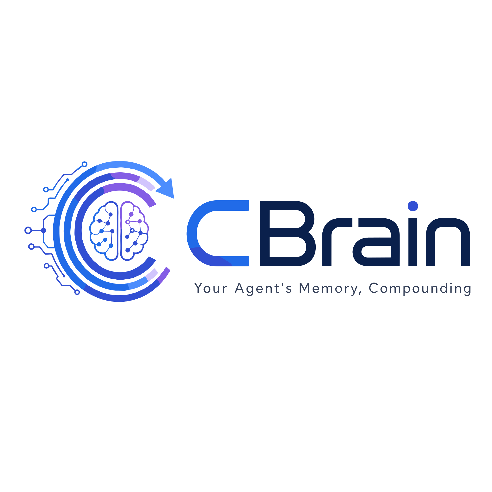

<div align="center">
  
</div>

<h1 align="center">CBrain</h1>

<p align="center">
  <em>Your Agent's Memory, Compounding. Agent 的记忆，复利生长。</em>
</p>

CBrain is an open-source personal knowledge brain for AI Agents. Inspired by [Karpathy's LLM Wiki pattern](https://x.com/karpathy) — human inputs, Agent compiles, knowledge compounds with every interaction.

CBrain 是一个开源的 AI Agent 个人知识大脑。受 Karpathy 的 LLM Wiki 模式启发 —— 人类输入，Agent 编译，知识在每次交互中复利增长。

## Why CBrain

LLMs forget everything between conversations. CBrain gives your Agent a persistent, compounding memory that grows richer over time.

- **Obsidian-native** — All pages are markdown files you can read, edit, and browse in Obsidian
- **Three-layer search** — Vector + Chinese FTS + Graph traversal, fused with RRF
- **Knowledge graph** — Wiki-link based relationships + auto NER entity/relationship extraction
- **Entity enrichment** — People and companies auto-promote through tiers as you mention them
- **41 MCP tools** — Full page CRUD, tags, links, timeline, version history, job queue, raw data, config, and observability
- **Version history** — Every page version snapshotted, with revert support
- **Multi-query expansion** — LLM generates search query variants for better recall, fused with RRF
- **Job queue** — SQLite-backed async job system with priority, retry, and status tracking
- **Raw data storage** — Binary BLOB storage attached to pages (images, PDFs, etc.)

LLM 在对话之间会遗忘一切。CBrain 为你的 Agent 提供持久的、复利增长的记忆。

- **Obsidian 原生** — 所有页面都是 Obsidian 可读的 Markdown 文件
- **三层搜索** — 向量 + 中文全文 + 图遍历，RRF 融合排序
- **知识图谱** — 基于 Wiki Link 的实体关系 + 自动 NER 实体/关系提取
- **实体丰富** — 人物和组织随提及次数自动升级
- **MCP 服务器** — 接入任何兼容 MCP 的 Agent
- **本地运行** — 无云依赖，数据留在你的机器上

## Quick Start

### Binary (recommended)

Download the latest binary from [Releases](https://github.com/chenhong/cbrain/releases):

```bash
./cbrain init
./cbrain ingest --type text --title "张三" --page-type entity "产品经理"
./cbrain query "张三"
./cbrain serve --http    # HTTP API on localhost:3399
```

### From source

```bash
git clone https://github.com/chenhong/cbrain.git
cd cbrain
bun install
bun run src/cli/index.ts init
bun run src/cli/index.ts ingest --type text --title "张三" "产品经理"
bun run src/cli/index.ts query "张三"
bun run src/cli/index.ts serve --http
```

> 完整文档：[使用指南](docs/usage.md) | [MCP 工具参考](docs/mcp-tools.md)

## Architecture

```
┌─────────────────────────────────────────┐
│  Skills Layer (SKILL.md = Agent Brain)  │  ← Judgment, workflow, domain knowledge
├─────────────────────────────────────────┤
│  CBrain Core (CLI + MCP Server)         │  ← File I/O, indexing, search
├─────────────────────────────────────────┤
│  Storage (SQLite + LanceDB)             │  ← Structured data + vector/FTS search
└─────────────────────────────────────────┘
    ↕ bidirectional sync
┌─────────────────────────────────────────┐
│  Obsidian Vault (SSOT)                  │  ← Human reads, Agent writes, same files
└─────────────────────────────────────────┘
```

**Key principle**: Obsidian vault is the single source of truth. SQLite and LanceDB are index layers — delete and rebuild anytime. All data lives in markdown files.

**核心原则**：Obsidian vault 是唯一事实来源。SQLite 和 LanceDB 只是索引层 —— 随时可以删除重建。所有数据都存在于 Markdown 文件中。

## Page Types

| Type | Directory | For |
|:-----|:----------|:----|
| entity | `entities/` | People, companies, organizations, products |
| concept | `concepts/` | Methods, theories, frameworks, principles |
| record | `records/` | Reading notes, articles, meeting notes, transcripts |
| insight | `insights/` | Auto-generated cross-domain connections and discoveries |

## CLI Commands (24 total)

### 大脑管理
```bash
cbrain init                              # 新建一个大脑（配置 + 目录 + 数据库）
cbrain status                            # 看一眼：多少页、多少关系、按类型分布
cbrain dream                             # 全量维护：sync → enrich → cleanup → health → report（带锁）
cbrain config                            # 查看当前配置
cbrain config --set ner.enabled=false    # 修改配置
```

### 内容操作
```bash
cbrain list                              # 列出所有页面
cbrain list -t entity -l 20              # 只看实体，最多 20 条
cbrain show <slug>                       # 查看一个页面的完整内容
cbrain delete <slug>                     # 删除一个页面
cbrain ingest <内容>                     # 录入新内容（--type, --title, --page-type）
```

### 搜索与图谱
```bash
cbrain query "搜索内容"                  # 混合搜索（向量 + 全文 + 图谱）
cbrain graph-query <slug>                # 图谱遍历（--mode traverse|backlinks|related）
```

### 标签与时间线
```bash
cbrain tags <slug>                       # 查看页面的所有标签
cbrain tags <slug> add "重要"            # 打标签
cbrain tags <slug> remove "重要"         # 去标签
cbrain timeline <slug>                   # 查看页面的时间线
cbrain timeline <slug> add --date 2024-03-01 --summary "张三加入ABC科技"
```

### 版本管理
```bash
cbrain versions <slug>                   # 查看一个页面的修改历史
cbrain revert <slug> <版本号>            # 回滚到某个历史版本
```

### 维护与诊断
```bash
cbrain dream                             # 夜间全量维护：sync → enrich → cleanup → health → report
cbrain sync                              # 把 vault 文件同步到索引
cbrain enrich                            # 实体重要性升级
cbrain health                            # 10 维度健康检查，输出报告
cbrain doctor                            # 快速诊断：数据库、文件、API 是否正常
cbrain check-resolvable                  # 检查 Skills 路由是否完整、有无冲突
cbrain watch                             # 监听文件变化，自动同步（后台守护进程）
```

### 服务
```bash
cbrain serve                             # 启动 MCP Server，供 AI Agent 调用
```

## Agent Integration

### HTTP (recommended)

Start as a persistent HTTP server:

```bash
cbrain serve --http    # → http://127.0.0.1:3399
```

Your Agent calls tools via HTTP:

```bash
curl -s http://127.0.0.1:3399/tools/query -d '{"query":"张三"}'
curl -s http://127.0.0.1:3399/tools/status -d '{}'
```

### MCP (stdio)

Add to your Agent's MCP config:

```json
{
  "mcpServers": {
    "cbrain": {
      "command": "cbrain",
      "args": ["serve"]
    }
  }
}
```

### MCP Tools (41 total)

**Core:**
| Tool | Description |
|:-----|:------------|
| `query` | Hybrid search (vector + FTS + graph + multi-query expansion) |
| `ingest` | Ingest content into the brain |
| `dialogue` | Ingest conversation snippets with incremental entity matching |
| `status` | Brain statistics (pages, links, chunks) |
| `health` | Health check |
| `sync` | Re-index vault files |
| `remove_orphans` | Remove DB entries with no vault file |
| `generate_indexes` | Generate index pages (dashboard, entities, concepts, sources) |
| `enrich` | Entity tier enrichment |

**Pages:**
| Tool | Description |
|:-----|:------------|
| `get_page` | Retrieve a page by slug |
| `list_pages` | List pages with type filter, limit, offset |
| `put_page` | Create or update a page |
| `delete_page` | Delete a page |
| `resolve_slugs` | Resolve title/slug queries to exact slugs |
| `writeback` | Write page changes back to vault |

**Tags:**
| Tool | Description |
|:-----|:------------|
| `get_tags` | List tags for a page |
| `add_tag` | Add a tag to a page |
| `remove_tag` | Remove a tag from a page |

**Links:**
| Tool | Description |
|:-----|:------------|
| `get_links` | Get links from/to a page |
| `remove_link` | Remove a link between pages |
| `graph_query` | Graph traversal (forward, backlinks, related) |

**Timeline:**
| Tool | Description |
|:-----|:------------|
| `get_timeline` | Get timeline events for a page |
| `add_timeline_entry` | Add a timeline event |

**Version History:**
| Tool | Description |
|:-----|:------------|
| `get_versions` | List all versions of a page |
| `revert_version` | Revert page to a specific version |

**Job Queue:**
| Tool | Description |
|:-----|:------------|
| `job_submit` | Submit a job to the queue |
| `job_list` | List jobs with optional status filter |
| `job_status` | Get detailed job status |
| `job_cancel` | Cancel a pending/running job |
| `job_retry` | Retry a failed job |

**Raw Data:**
| Tool | Description |
|:-----|:------------|
| `put_raw_data` | Store binary data (base64) attached to a page |
| `get_raw_data` | Retrieve raw data by slug + key |
| `list_raw_data` | List raw data keys for a page |
| `delete_raw_data` | Delete raw data by slug + key |

**Observability:**
| Tool | Description |
|:-----|:------------|
| `get_chunks` | Get chunks for a page |
| `get_ingest_log` | View ingest log |
| `get_config` | Get a config value |
| `set_config` | Set a config value |

## Search System

Four search strategies, fused with Reciprocal Rank Fusion (RRF):

1. **Multi-query expansion** — LLM generates 2-3 query variants for wider recall (default on)
2. **Vector search** — Semantic similarity via embedding (default: 智谱 embedding-3, 2048d)
3. **Chinese FTS** — Full-text search via SQLite FTS5 trigram tokenizer
4. **Graph traversal** — Relationship-based discovery through the knowledge graph

```bash
# Default: all three combined
cbrain query "怎么优化RAG性能"

# Single strategy
cbrain query "张三" --strategy fts
cbrain query "RAG optimization" --strategy vector
```

## Entity Enrichment

Entities auto-promote through tiers based on mention frequency:

| Tier | Criteria | Behavior |
|:-----|:---------|:---------|
| 1 | 10+ mentions | Core entity — always check before decisions |
| 2 | 3-9 mentions | Active entity — check when relevant |
| 3 | 0-2 mentions | Observed — lookup on demand |

实体根据提及频率自动升级：

| 层级 | 标准 | 行为 |
|:-----|:-----|:-----|
| 1 | 10+ 次提及 | 核心实体 —— 决策前必查 |
| 2 | 3-9 次提及 | 活跃实体 —— 相关时查阅 |
| 3 | 0-2 次提及 | 观察实体 —— 按需查阅 |

## Skills

CBrain includes Agent-facing skill files that teach your Agent how to use the brain:

| Skill | Purpose |
|:------|:--------|
| `brain-ops` | 5-step protocol + 38-tool reference (default skill) |
| `query` | Hybrid search: vector + FTS + graph |
| `review` | Deep topic review — gather everything, synthesize coherent picture |
| `connect` | Relationship analysis — find and explain connections between entities |
| `ingest` | Content routing and compilation |
| `enrich` | Tiered entity enrichment |
| `cleanup` | Guided cleanup — find duplicates, orphans, stale stubs |
| `write` | Knowledge-based writing — gather from brain, produce polished output |
| `dream` | Nightly auto-maintenance pipeline |
| `signal-detector` | Extract entities and ideas from messages |
| `RESOLVER.md` | Intent→Skill routing table (21 rules, 8 categories) |

## Configuration

CBrain uses `cbrain.json` in your project directory:

```json
{
  "vault_path": "./vault",
  "db_path": "./brain.sqlite",
  "lancedb_path": "./lancedb",
  "embedding": {
    "provider": "zhipu",
    "model": "embedding-3",
    "dimensions": 2048,
    "api_key": "your-api-key"
  },
  "ner": {
    "enabled": true,
    "llm_provider": "zhipu",
    "llm_model": "glm-5-turbo",
    "llm_api_key": "your-api-key"
  }
}
```

Set `CBRAIN_ZHIPU_API_KEY` environment variable as an alternative to config file.

## Tech Stack

| Component | Choice | Why |
|:----------|:-------|:----|
| Runtime | Bun | Fast, native TypeScript |
| Structured Storage + FTS | SQLite (bun:sqlite + FTS5 trigram) | Zero config, relational queries, Chinese full-text search |
| Vector Search | LanceDB | High-performance ANN vector search |
| Embedding | 智谱 embedding-3 | Best Chinese embeddings, 2048d |
| Agent Interface | MCP Server | Standard protocol for Agent tools |
| Human Interface | Obsidian | Graph view, backlinks, Dataview |

## Development

```bash
# Install dependencies
bun install

# Run tests
bun test

# Type check
bun run lint

# Run CLI in dev mode
bun run dev init
```

## Roadmap

See [CHANGELOG.md](./CHANGELOG.md) for detailed version history.

| Version | Focus | Status |
|:--------|:------|:-------|
| v1.0 | HTTP API, NER (glm-5-turbo), 41 MCP tools, binary distribution | ✅ Current |
| v1.1 | Web UI, faster embedding, multi-user | Planned |

## About This Project

这不是大厂项目，也不是技术大牛的作品。我从事医药行业，不是专业程序员。

做 CBrain 纯粹是因为被一个痛点折磨太久了——**Agent 很强，但它不会变聪明。**

每次对话都是一张白纸。你跟它说过的人、讨论过的方案、做过的决策，下次全忘了。更致命的是，它永远不会从这些经验中学习、归纳、进化。每天几十次交互积累的信息，散落在无数对话记录里——没有沉淀，没有连接，没有成长。Agent 用了三个月和用了三天，没区别。

[Andrej Karpathy](https://x.com/karpathy) 提过一个思路：让 LLM 维护自己的 wiki——人输入，Agent 编译，知识复利增长。这直接启发了 CBrain 的核心设计。[Garry Tan](https://x.com/garrytan) 的 "builders build" 哲学也给了我一脚——别等完美的工具，自己动手做一个。

**CBrain = Compounding Brain。** C 是复利（Compounding）——知识不是线性堆叠，而是像复利一样，越积累连接越多，价值增长越快。它不只是 Agent 的记忆层，也是我自己的第二大脑。每天的人、事、洞察，Agent 帮我记录、连接、沉淀，时间越久，它比我更了解我的工作。

这是我的第一个开源项目。五一假期一周时间，从零到 v1.0。代码肯定有很多问题——测试覆盖不完美，架构有打磨空间，文档还能更好。但它确实解决了我的问题，而且我想把它分享出来，希望能帮到有同样痛点的人。

后续会不定期更新。Issue 和 PR 都欢迎。

如果你也希望你的 Agent 能越用越聪明——fork 它，改它，把它变成你自己的第二大脑。

---

This isn't a Big Tech project, nor is it the work of a career engineer. I work in the pharmaceutical industry, not software.

I built CBrain because I was tired of one pain: **Agents are powerful, but they never get smarter.**

Every conversation starts from scratch. People you mentioned, plans you discussed, decisions you made — gone next time. Worse, they never learn from these experiences — no reflection, no pattern recognition, no evolution. Dozens of interactions per day, and all that knowledge scatters across chat logs. No accumulation. No connections. No growth. An Agent used for three months is no wiser than one used for three days.

[Andrej Karpathy](https://x.com/karpathy) once described the idea of an LLM maintaining its own wiki — human inputs, Agent compiles, knowledge compounds. That directly inspired CBrain's core design. [Garry Tan](https://x.com/garrytan)'s "builders build" philosophy gave me the final push — don't wait for the perfect tool, build one yourself.

**CBrain = Compounding Brain.** The "C" stands for Compounding — knowledge doesn't just pile up linearly. Like compound interest, the more you accumulate, the more connections form, and the faster the value grows. It's not just a memory layer for Agents — it's my own second brain. Every day's people, events, and insights get recorded, connected, and compounded by my Agent. Over time, it understands my work better than I do.

This is my first open-source project. Built over the May Day holiday week, from zero to v1.0. The code definitely has issues — test coverage isn't perfect, architecture needs polishing, docs can be better. But it solves my problem, and I'm sharing it in case it solves yours too.

I'll continue updating periodically. Issues and PRs welcome.

If you want your Agent to get smarter over time too — fork it, hack it, make it your own second brain.

## License

MIT
