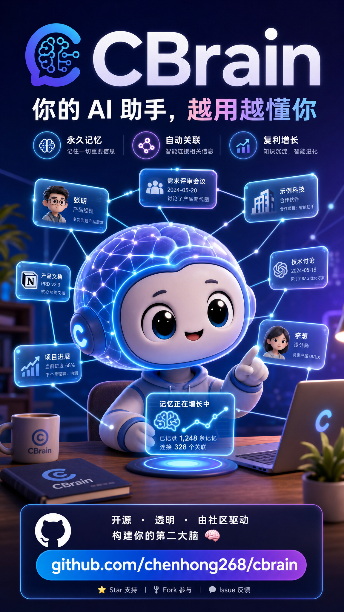

<div align="center">
  
</div>

<h1 align="center">CBrain</h1>

<p align="center">
  <em>Your Agent's Memory, Compounding. Agent 的记忆，复利生长。</em>
</p>

CBrain is an open-source personal knowledge brain for AI Agents. Inspired by [Karpathy's LLM Wiki pattern](https://x.com/karpathy) — human inputs, Agent compiles, knowledge compounds with every interaction.

CBrain 是一个开源的 AI Agent 个人知识大脑。受 Karpathy 的 LLM Wiki 模式启发 —— 人类输入，Agent 编译，知识在每次交互中复利增长。

## Why CBrain

LLMs forget everything between conversations. CBrain gives your Agent a persistent, compounding memory that grows richer over time.

- **Obsidian-native** — All pages are markdown files you can read, edit, and browse in Obsidian
- **Three-layer search** — Vector + Chinese FTS + Graph traversal, fused with RRF
- **Knowledge graph** — Wiki-link based relationships + auto NER entity/relationship extraction
- **Entity enrichment** — People and companies auto-promote through tiers as you mention them
- **82 MCP tools** — Full page CRUD, tags, links, timeline, version history, job queue, and observability
- **Version history** — Every page version snapshotted, with revert support
- **Multi-query expansion** — LLM generates search query variants for better recall, fused with RRF
- **Job queue** — SQLite-backed async job system with priority, retry, and status tracking
- **Raw data storage** — Binary BLOB storage attached to pages (images, PDFs, etc.)

LLM 在对话之间会遗忘一切。CBrain 为你的 Agent 提供持久的、复利增长的记忆。

- **Obsidian 原生** — 所有页面都是 Obsidian 可读的 Markdown 文件
- **三层搜索** — 向量 + 中文全文 + 图遍历，RRF 融合排序
- **知识图谱** — 基于 Wiki Link 的实体关系 + 自动 NER 实体/关系提取
- **实体丰富** — 人物和组织随提及次数自动升级
- **MCP 服务器** — 接入任何兼容 MCP 的 Agent
- **本地存储** — SQLite + Markdown + LanceDB 全部存在你的机器上。但向量嵌入、NER、洞察生成会把待处理文本连同 API Key 发往你配置的模型 provider（智谱/DeepSeek）

## Quick Start

> **新用户？** 先看 [安装与上手指南](docs/install-onboarding.md) — 从零到跑起来，10 分钟。

### Bun global install (recommended)

1. Install [Bun](https://bun.sh) (≥ 1.2):

```bash
curl -fsSL https://bun.sh/install | bash
```

2. Install CBrain — always pin to an explicit tag:

```bash
bun install -g github:chenhong268/cbrain#v2.0.1
```

3. Verify:

```bash
cbrain --version
```

4. Run:

```bash
cbrain init                              # 创建配置文件和目录
export ZHIPU_API_KEY=your-zhipu-api-key  # 或编辑 cbrain.json 填入 API key
cbrain ingest --type text --title "实体A" --page-type entity "产品经理"
cbrain query "实体A"
cbrain serve --http                      # 启动 HTTP 服务 → localhost:3399
```

**Upgrading** — reinstall with the new tag:

```bash
bun remove -g cbrain
bun install -g github:chenhong268/cbrain#v2.0.1
```

**Uninstalling:**

```bash
bun remove -g cbrain
```

> **Note:** Standalone release binaries are not available yet. The supported path is the version-pinned Bun global install shown above.

### From source (developer / contributor)

1. Install [Bun](https://bun.sh):

```bash
curl -fsSL https://bun.sh/install | bash
```

2. Clone and setup:

```bash
git clone https://github.com/chenhong268/cbrain.git
cd cbrain
bun install
```

3. Run with `bun run` instead of the global `cbrain` command:

```bash
bun run dev init
bun run dev ingest --type text --title "人物A" "产品经理"
bun run dev query "人物A"
bun run dev serve --http
```

### API Keys

CBrain 需要以下 API key：

| 服务 | 用途 | 获取地址 |
|:-----|:-----|:---------|
| 智谱（Zhipu） | 向量嵌入 + NER 实体提取 | [open.bigmodel.cn](https://open.bigmodel.cn) |
| DeepSeek（可选） | 洞察生成（reflect） | [platform.deepseek.com](https://platform.deepseek.com) |

> 完整文档：[使用指南](docs/usage.md) | [MCP 工具参考](docs/mcp-tools.md)

## Architecture

```
┌─────────────────────────────────────────┐
│  Skills Layer (SKILL.md = Agent Brain)  │  ← Judgment, workflow, domain knowledge
├─────────────────────────────────────────┤
│  CBrain Core (CLI + MCP Server)         │  ← File I/O, indexing, search
├─────────────────────────────────────────┤
│  Storage (SQLite + LanceDB)             │  ← Structured data + vector/FTS search
└─────────────────────────────────────────┘
    ↕ bidirectional sync
┌─────────────────────────────────────────┐
│  Obsidian Vault (SSOT)                  │  ← Human reads, Agent writes, same files
└─────────────────────────────────────────┘
```

**Key principle**: Obsidian vault is the single source of truth. SQLite and LanceDB are index layers — if corrupted, rebuild safely. Always `cbrain backup` first, then by scope: per-page `cbrain sync --slug <slug> --reindex`; quarantined pages `cbrain sync --reindex-quarantined`; whole-index corruption `cbrain sync --reindex-vectors`. Never delete them directly. All data lives in markdown files.

**核心原则**：Obsidian vault 是唯一事实来源。SQLite 和 LanceDB 只是索引层 —— 损坏时先 `cbrain backup` 备份，再按场景重建：单页 `cbrain sync --slug <slug> --reindex`；watcher 隔离页 `cbrain sync --reindex-quarantined`；整库损坏 `cbrain sync --reindex-vectors`。切勿直接删除。所有数据都存在于 Markdown 文件中。

## Page Types

| Type | Directory | For |
|:-----|:----------|:----|
| entity | `entities/` | People, companies, organizations, products |
| concept | `concepts/` | Methods, theories, frameworks, principles |
| record | `records/` | Reading notes, articles, meeting notes, transcripts |
| insight | `insights/` | Auto-generated cross-domain connections and discoveries |

## CLI Commands (43 total)

### 大脑管理
```bash
cbrain init                              # 新建一个大脑（配置 + 目录 + 数据库）
cbrain status                            # 看一眼：多少页、多少关系、按类型分布
cbrain dream                             # 全量维护：sync → enrich → cleanup → health → report（带锁）
cbrain config                            # 查看当前配置
cbrain config --set ner.enabled=false    # 修改配置
```

### 内容操作
```bash
cbrain list                              # 列出所有页面
cbrain list -t entity -l 20              # 只看实体，最多 20 条
cbrain show <slug>                       # 查看一个页面的完整内容
cbrain delete <slug>                     # 删除一个页面
cbrain ingest <内容>                     # 录入新内容（--type, --title, --page-type）
```

### 搜索与图谱
```bash
cbrain query "搜索内容"                  # CLI 默认 all：混合搜索（向量 + 全文 + 图谱）
cbrain graph-query <slug>                # 图谱遍历（--mode traverse|backlinks|related）
```

### 标签与时间线
```bash
cbrain tags <slug>                       # 查看页面的所有标签
cbrain tags <slug> add "重要"            # 打标签
cbrain tags <slug> remove "重要"         # 去标签
cbrain timeline <slug>                   # 查看页面的时间线
cbrain timeline <slug> add --date 2024-03-01 --summary "人物A加入组织C"
```

### 版本管理
```bash
cbrain versions <slug>                   # 查看一个页面的修改历史
cbrain revert <slug> <版本号>            # 回滚到某个历史版本
```

### 维护与诊断
```bash
cbrain dream                             # 夜间全量维护：sync → enrich → cleanup → health → report
cbrain sync                              # 把 vault 文件同步到索引
cbrain enrich                            # 实体重要性升级
cbrain health                            # 14 维度健康检查，输出报告
cbrain health-debt                       # 健康债务修复计划（dry-run，分组：可自动修复/需审核/观察/阻塞）
cbrain doctor                            # 快速诊断：数据库、文件、API 是否正常
cbrain doctor --first-run                # 2.0 首次运行全面检查（config → paths → DB → index → services）
cbrain doctor --first-run --json         # 同上，JSON 输出（供 Agent 调用）
cbrain perf-diagnose                     # 只读性能诊断：最近 journey 的慢查询/慢步骤分布（不写入）
cbrain perf-diagnose --json --days 30    # 同上，30 天窗口、机器可读 JSON
```

> **Hermes cron 集成**：见 [docs/hermes-integration.md](docs/hermes-integration.md) —— 用 `bin/cbrain-maintenance.sh` wrapper 走 HTTP `/mcp`，**不要裸调 CLI**（serve 在跑时并发写损坏数据）。

> **运维巡检**：见 [docs/patrol.md](docs/patrol.md) —— daily（`bin/daily-patrol.sh` bounded）/ nightly（`bun run check`）/ release 三层分离。daily 不跑 full `bun test`（避免短 timeout 误报）。

### 服务
```bash
cbrain serve                             # 启动 MCP Server，供 AI Agent 调用
```

## Agent Integration

> **Compatibility**: CBrain is developed and tested with [Hermes Agent](https://github.com/NousResearch/hermes-agent). It uses the standard MCP protocol — any MCP-compatible Agent should work in theory, but others haven't been tested yet. If you try it with a different Agent, feedback is welcome.
>
> **兼容性**：CBrain 以 Hermes Agent 为开发对象，使用标准 MCP 协议。理论上任何兼容 MCP 的 Agent 都能用，但除 Hermes 外尚未实际测试。欢迎反馈其他 Agent 的使用情况。

### Feature Categories

Not all features work the same way. Some are CLI one-liners, some need an Agent to call on demand, and some need the Agent to set up **periodic tasks** to truly deliver value.

| Category | Features | How it works |
|:---------|:---------|:-------------|
| **Standalone CLI** | `query`, `ingest`, `list`, `show`, `delete`, `tags`, `timeline`, `versions`, `health`, `doctor`, `sync` | 直接用，不需要 Agent |
| **Agent on-demand** | `get_page`, `put_page`, `ingest_dialogue`, `resolve_slugs`, `graph_query`, `job_submit`, `status` | Agent 在对话中按需调用 |
| **Agent periodic tasks** | `dream` (nightly), `discover` (every 3 days), `enrich` (weekly), `reflect` (after conversations), `cleanup` (weekly) | 需要 Agent 配置定时任务，自动运行 |

The third category is where CBrain truly compounds. Without periodic tasks, you still get a working knowledge base. **With them, the brain maintains itself** — entity enrichment, structural discoveries, insights, and cleanup happen automatically.

第三类功能是 CBrain 复利增长的关键。没有定时任务，你得到的是一个可用的知识库。**有了定时任务，大脑自己维护自己** —— 实体升级、结构发现、洞察生成、自动清理，全部自动化。

To set up periodic tasks with Hermes:

```bash
# In your Agent's skill config (SKILL.md), add scheduled tasks:
# - Every day:  dream  # MCP tool（走 /mcp）；cron 场景用 bin/cbrain-maintenance.sh，勿裸调 CLI，见 docs/hermes-integration.md
# - Every 3 days: cbrain discover
# - Weekly: cbrain enrich && cbrain dedup   # (cleanup is an Agent skill, not a CLI command)
```

### Agent Memory Rules

To get the most out of CBrain, your Agent needs judgment rules stored in its memory — these teach it *when* and *how* to use each tool. Below are recommended rules distilled from real-world usage. Copy them into your Agent's memory system (e.g., MEMORY.md, system prompt, or equivalent).

让你的 Agent 充分发挥 CBrain 的价值，需要在记忆中写入判断规则——教它**何时**、**如何**使用每个工具。以下是从实际使用中提炼的推荐规则。

**1. Search Routing（搜索路由）**

Route to the right tool based on user intent:

| User intent | Tool | Why |
|:------------|:-----|:----|
| Recall / deep understanding / what is / tell me about | `deep_recall` | One call: page + links + timeline |
| Summarize / overview / big picture | `summarize` | Aggregated cross-page view |
| Analyze / brainstorm / cross-domain | `brain_storm` | Cross-domain pattern finding |
| Quick search / find / look up | `query` | Fast — returns slug + title + snippet |
| Expand / more details | `expand_entity` | Requires slug first |

Anti-patterns:
- ❌ Chaining `query` + `get_page` + `get_links` + `get_timeline` → `deep_recall` does it in one call
- ❌ Routing summarize requests to `query` → wrong tool
- ❌ Calling `expand_entity` without a slug → query first
- ❌ Skipping query tools because you "know" the slug → query tools handle session tracking and weight learning

**2. Storage Routing（存储路由）**

When saving content, route to the correct page type:

| Content | Page type |
|:--------|:----------|
| People / companies / products / organizations | `entity` |
| Recognized methodologies / theories / models | `concept` |
| Events / articles / notes / meetings | `record` |
| System-generated analysis / discoveries | `insight` |

- Unsure between entity vs concept → pick `entity` (easier to reclassify later)
- ❌ Don't treat generic business jargon as concepts
- ❌ Don't skip NER — content like poetry, philosophy often contains extractable names

**3. Session Tracking（会话追踪）**

Generate a unique `session_id` per conversation (format: `YYYYMMDD-random`, e.g., `20260516-a3f7k`). Pass it to every `deep_recall` / `query` / `graph_query` call. This enables **co-occurrence learning** — entities queried together get associated, so CBrain learns context-sensitive activation (e.g., "Jung" activates "Freud" in a psychology context).

If results help the user, call `record_feedback` to reinforce quality.

**4. Search Pitfalls（搜索注意事项）**

Two common mistakes:

1. **Short Chinese names** — `query` and `resolve_slugs` may not match on first try. Don't conclude "doesn't exist" from a single miss.
2. **Organization hierarchies** — Always use `graph_query(depth=2)` to traverse the subgraph. Don't rely on page-level explicit links alone — relationships often live in the graph, not the page body.

**5. Entity Page Structure（实体页面规范）**

For people or team entities, always include a structured "Organization" section: superior / peers / subordinates / reporting chain. Don't scatter descriptions loosely. After generating a dossier, check if existing record data was missed and supplement the page body before regenerating.

**6. Expiry Warning Handling（过期信息处理）**

`deep_recall` / `query` / `expand_entity` may return an `expiry_warning` field (`"⚠️ expired"` or `"⏰ expiring soon"`). When present:

1. Tell the user: "This information is expired / expiring soon and may not be current"
2. Still show the information — just note the staleness
3. Offer: "Would you like to update this information?"

Don't suppress results because of an expiry warning.

**7. Proactive Dual-Save（主动双存）**

When the user provides business information (meeting notes, client updates, team feedback), always save to **both**:

1. The user's reminder / task system
2. CBrain (knowledge retention)

Don't wait for the user to explicitly say "save to brain" — proactively judge.

### HTTP (recommended)

Start as a persistent HTTP server:

```bash
cbrain serve --http    # → http://127.0.0.1:3399
```

Your Agent calls tools via HTTP:

```bash
curl -s http://127.0.0.1:3399/tools/query -d '{"query":"人物A"}'
curl -s http://127.0.0.1:3399/tools/status -d '{}'
```

### MCP (stdio)

Add to your Agent's MCP config:

```json
{
  "mcpServers": {
    "cbrain": {
      "command": "cbrain",
      "args": ["serve"]
    }
  }
}
```

### MCP Tools (82 total)

**Core:**
| Tool | Description |
|:-----|:------------|
| `query` | 底层关键词搜索，默认 smart（FTS 优先，空则回退混合）。自然语言问题用 deep_recall |
| `ingest` | Ingest content into the brain |
| `ingest_dialogue` | Ingest conversation snippets with incremental entity matching |
| `status` | Brain statistics (pages, links, chunks) |
| `health` | Health check |
| `sync` | Re-index vault files |
| `remove_orphans` | Remove DB entries with no vault file |
| `generate_indexes` | Generate index pages (dashboard, entities, concepts, sources) |
| `enrich` | Entity tier enrichment |

**Pages:**
| Tool | Description |
|:-----|:------------|
| `get_page` | Retrieve a page by slug |
| `list_pages` | List pages with type filter, limit, offset |
| `put_page` | Create or update a page (defaults to patch; mode='replace' to overwrite) |
| `delete_page` | Delete a page |
| `resolve_slugs` | Resolve title/slug queries to exact slugs |
| `writeback` | Write page changes back to vault |

**Tags:**
| Tool | Description |
|:-----|:------------|
| `get_tags` | List tags for a page |
| `add_tag` | Add a tag to a page |
| `remove_tag` | Remove a tag from a page |

**Links:**
| Tool | Description |
|:-----|:------------|
| `get_links` | Get links from/to a page |
| `remove_link` | Remove a link between pages |
| `graph_query` | Graph traversal (forward, backlinks, related) |

**Timeline:**
| Tool | Description |
|:-----|:------------|
| `get_timeline` | Get timeline events for a page |
| `add_timeline_entry` | Add a timeline event |

**Version History:**
| Tool | Description |
|:-----|:------------|
| `get_versions` | List all versions of a page |
| `revert_version` | Revert page to a specific version |

**Job Queue:**
| Tool | Description |
|:-----|:------------|
| `job_submit` | Submit a job to the queue |
| `job_list` | List jobs with optional status filter |
| `job_status` | Get detailed job status |
| `job_cancel` | Cancel a pending/running job |
| `job_retry` | Retry a failed job |

**Observability:**
| Tool | Description |
|:-----|:------------|
| `get_chunks` | Get chunks for a page |
| `get_ingest_log` | View ingest log |

## Search System

Four search strategies, fused with Reciprocal Rank Fusion (RRF):

1. **Multi-query expansion** — LLM generates 2-3 query variants for wider recall (default on)
2. **Vector search** — Semantic similarity via embedding (default: 智谱 embedding-3, 2048d)
3. **Chinese FTS** — Full-text search via SQLite FTS5 trigram tokenizer
4. **Graph traversal** — Relationship-based discovery through the knowledge graph

> CLI `cbrain query` 默认 `--strategy all`（全量混合）；MCP 工具 `query` 默认 `smart`（FTS 优先，空则回退混合）——两者默认策略不同。

```bash
# CLI 默认 all（全量混合三策略）
cbrain query "怎么优化RAG性能"

# Single strategy
cbrain query "人物A" --strategy fts
cbrain query "RAG optimization" --strategy vector
```

## Entity Enrichment

Entities auto-promote through tiers based on mention frequency:

| Tier | Criteria | Behavior |
|:-----|:---------|:---------|
| 1 | 10+ mentions | Core entity — always check before decisions |
| 2 | 3-9 mentions | Active entity — check when relevant |
| 3 | 0-2 mentions | Observed — lookup on demand |

实体根据提及频率自动升级：

| 层级 | 标准 | 行为 |
|:-----|:-----|:-----|
| 1 | 10+ 次提及 | 核心实体 —— 决策前必查 |
| 2 | 3-9 次提及 | 活跃实体 —— 相关时查阅 |
| 3 | 0-2 次提及 | 观察实体 —— 按需查阅 |

## Skills

CBrain includes Agent-facing skill files that teach your Agent how to use the brain:

| Skill | Purpose |
|:------|:--------|
| `brain-ops` | 5-step protocol + 82-tool reference (default skill) |
| `query` | Hybrid search: vector + FTS + graph |
| `review` | Deep topic review — gather everything, synthesize coherent picture |
| `connect` | Relationship analysis — find and explain connections between entities |
| `ingest` | Content routing and compilation |
| `enrich` | Tiered entity enrichment |
| `cleanup` | Guided cleanup — find duplicates, orphans, stale stubs |
| `write` | Knowledge-based writing — gather from brain, produce polished output |
| `dream` | Nightly auto-maintenance pipeline |
| `signal-detector` | Extract entities and ideas from messages |
| `RESOLVER.md` | Intent→Skill routing table (21 rules, 8 categories) |

## Configuration

CBrain uses `cbrain.json` in your project directory:

```json
{
  "vault_path": "./vault",
  "db_path": "./brain.sqlite",
  "lancedb_path": "./lancedb",
  "embedding": {
    "provider": "zhipu",
    "model": "embedding-3",
    "dimensions": 2048,
    "api_key": "your-api-key"
  },
  "ner": {
    "enabled": true,
    "llm_provider": "zhipu",
    "llm_model": "glm-5-turbo",
    "llm_api_key": "your-api-key"
  }
}
```

Set `ZHIPU_API_KEY` environment variable as an alternative to config file.

## Tech Stack

| Component | Choice | Why |
|:----------|:-------|:----|
| Runtime | Bun | Fast, native TypeScript |
| Structured Storage + FTS | SQLite (bun:sqlite + FTS5 trigram) | Zero config, relational queries, Chinese full-text search |
| Vector Search | LanceDB | High-performance ANN vector search |
| Embedding | 智谱 embedding-3 | Best Chinese embeddings, 2048d |
| Agent Interface | MCP Server | Standard protocol for Agent tools |
| Human Interface | Obsidian | Graph view, backlinks, Dataview |

## Development

```bash
# Install dependencies
bun install

# Run tests
bun test

# Type-check (src only)
bun run typecheck

# Type-check (src + tests)
bun run typecheck:tests

# Lint (typecheck src + tests + biome)
bun run lint

# Full gate (lint + tests)
bun run check

# Run CLI in dev mode
bun run dev init
```

## Roadmap

See [CHANGELOG.md](./CHANGELOG.md) for the full version history (current: v2.0.1).

| Version | Focus | Status |
|:--------|:------|:-------|
| v2.0.1 | Recall 可用性与 HTTP-MCP 长请求稳定性修复：`deep_recall` 默认 compact 输出；长 sync/ingest 请求不再被 Bun 默认 idle timeout 掐断 | ✅ Current |
| v2.0.0 | Agentic memory kernel：自然语言前门、Hermes display/summary/raw 边界、EvidenceBoard/grounded recall、single-writer 多 Agent 拓扑、v2 发布门禁与安装上手路径 | |
| v1.0–v1.9.8 | MCP-first 架构、三层搜索、NER、Insight/Discovery、agentic 工具、provenance、安全恢复、v2 RC 发布门禁、single-writer 多 Agent 拓扑、启动/维护稳定性加固 | Previous |
| 未来 | Web UI、eval 框架、durable job queue | Planned |

## About This Project

这不是大厂项目，也不是技术大牛的作品。我从事医药行业，不是专业程序员。

做 CBrain 纯粹是因为被一个痛点折磨太久了——**Agent 很强，但它不会变聪明。**

每次对话都是一张白纸。你跟它说过的人、讨论过的方案、做过的决策，下次全忘了。更致命的是，它永远不会从这些经验中学习、归纳、进化。每天几十次交互积累的信息，散落在无数对话记录里——没有沉淀，没有连接，没有成长。Agent 用了三个月和用了三天，没区别。

[Andrej Karpathy](https://x.com/karpathy) 提过一个思路：让 LLM 维护自己的 wiki——人输入，Agent 编译，知识复利增长。这直接启发了 CBrain 的核心设计。[Garry Tan](https://x.com/garrytan) 的 "builders build" 哲学也给了我一脚——别等完美的工具，自己动手做一个。

**CBrain = Compounding Brain。** C 是复利（Compounding）——知识不是线性堆叠，而是像复利一样，越积累连接越多，价值增长越快。它不只是 Agent 的记忆层，也是我自己的第二大脑。每天的人、事、洞察，Agent 帮我记录、连接、沉淀，时间越久，它比我更了解我的工作。

这是我的第一个开源项目。五一假期一周时间，从零到 v1.0。代码肯定有很多问题——测试覆盖不完美，架构有打磨空间，文档还能更好。但它确实解决了我的问题，而且我想把它分享出来，希望能帮到有同样痛点的人。

后续会不定期更新。Issue 和 PR 都欢迎。

如果你也希望你的 Agent 能越用越聪明——fork 它，改它，把它变成你自己的第二大脑。

---

This isn't a Big Tech project, nor is it the work of a career engineer. I work in the pharmaceutical industry, not software.

I built CBrain because I was tired of one pain: **Agents are powerful, but they never get smarter.**

Every conversation starts from scratch. People you mentioned, plans you discussed, decisions you made — gone next time. Worse, they never learn from these experiences — no reflection, no pattern recognition, no evolution. Dozens of interactions per day, and all that knowledge scatters across chat logs. No accumulation. No connections. No growth. An Agent used for three months is no wiser than one used for three days.

[Andrej Karpathy](https://x.com/karpathy) once described the idea of an LLM maintaining its own wiki — human inputs, Agent compiles, knowledge compounds. That directly inspired CBrain's core design. [Garry Tan](https://x.com/garrytan)'s "builders build" philosophy gave me the final push — don't wait for the perfect tool, build one yourself.

**CBrain = Compounding Brain.** The "C" stands for Compounding — knowledge doesn't just pile up linearly. Like compound interest, the more you accumulate, the more connections form, and the faster the value grows. It's not just a memory layer for Agents — it's my own second brain. Every day's people, events, and insights get recorded, connected, and compounded by my Agent. Over time, it understands my work better than I do.

This is my first open-source project. Built over the May Day holiday week, from zero to v1.0. The code definitely has issues — test coverage isn't perfect, architecture needs polishing, docs can be better. But it solves my problem, and I'm sharing it in case it solves yours too.

I'll continue updating periodically. Issues and PRs welcome.

If you want your Agent to get smarter over time too — fork it, hack it, make it your own second brain.

## License

MIT
