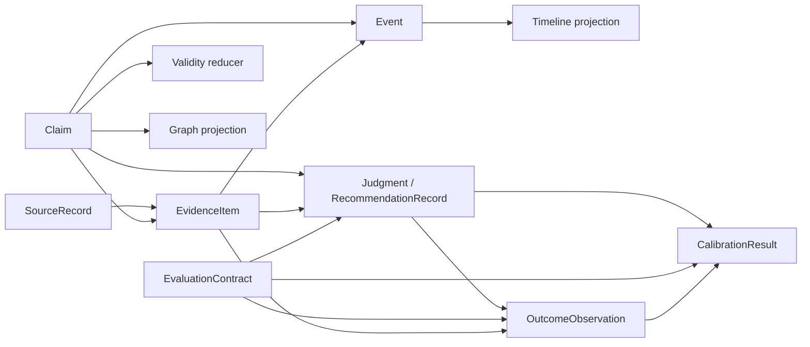
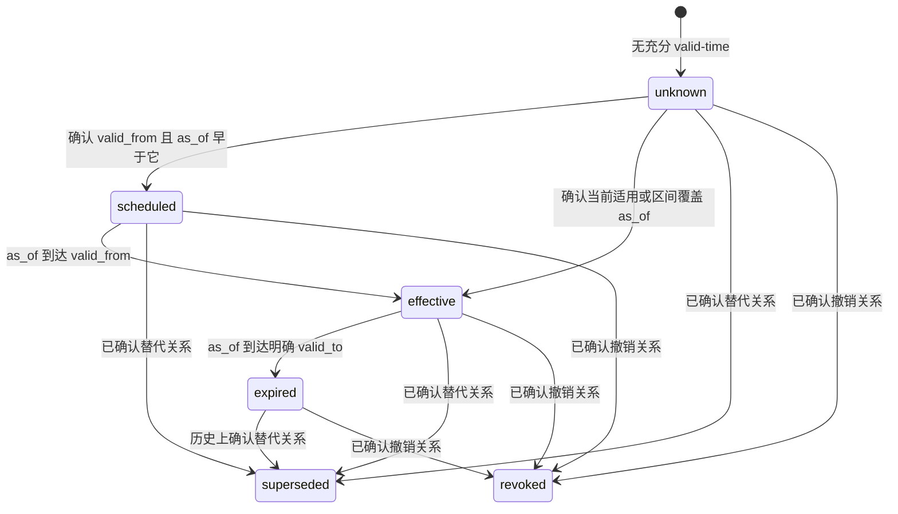
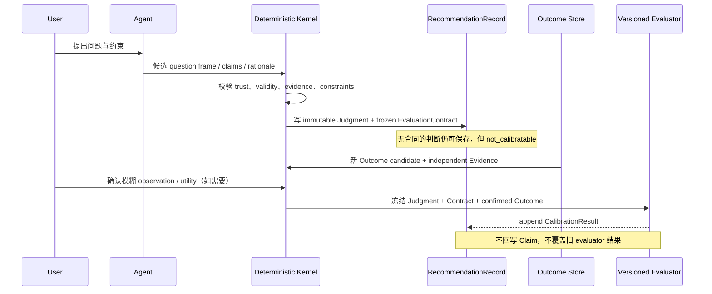

# Evidence–Claim–Validity 与 Judgment Calibration 合同

> Issue: #340（#339 Phase 0）
>
> 状态：设计合同，尚未批准任何运行时、数据库或公开接口变更
>
> 决策摘要：推荐 **additive sidecar Claim–Evidence kernel + compatibility adapters**；Phase 1 实施前仍需通过数据模型门。

## 1. 要解决的根本问题

CBrain 现在能找到页面、片段、关系和时间线，也能按 `trust_state` 区分事实、用户想法和候选信息。但是“找到了一段文字”仍可能在同一个临时对象中同时承担三种职责：

1. 它是来自某个来源的可定位片段；
2. 它表达了一条主张；
3. 它被当作可以支持回答的事实。

这三件事不是一回事。来源存在且片段未被篡改，只能证明“来源确实这样写过”，不能自动证明其中的主张正确、适用于当前问题，或者现在仍然有效。

本合同建立一条可审计但不过度扩张的语义链：

```text
SourceRecord → EvidenceItem → Claim
Claim / Event → current 或 historical Graph / Timeline projection
Claim + constraints → Judgment / Recommendation
Judgment + frozen EvaluationContract + OutcomeObservation → CalibrationResult
```

这是用户理解的 provenance 流程，不是数据库外键方向。规范化对象中，Agent 抽取的 Claim 先以 candidate 形式独立表达，EvidenceItem 再绑定 SourceVersion 与 Claim；显式用户授权仍可按既有治理路径产生 trusted transition，因此不会形成 Source/Evidence/Claim 循环。

### 1.1 用户价值

合同落地后，CBrain 应能分别回答：

- 原文在哪里，当前还能否核验；
- 原文支持、反驳、限制或补充的是哪一条主张；
- 这条主张是事实、观察、用户想法还是 Agent 推断；
- 它在什么时间范围内有效，当前是否已被确认替代；
- 当时的判断用了哪些主张、假设和约束；
- 后来观察到了什么，是否满足事先冻结的评估标准。

### 1.2 四组必须正交的概念

| 维度 | 回答的问题 | 不能替代什么 |
|---|---|---|
| Evidence integrity | locator、excerpt、hash 是否匹配 | 不能证明 Claim 正确 |
| Source authority | 来源在哪个明确范围内有资格陈述 | 不能形成全局“真相分数” |
| Claim trust / validity | 主张是否被接受、何时有效 | 不能由回答置信度反推 |
| Answer confidence | 本次回答的证据充分程度 | 不能写回 Claim 或 Source |

## 2. 范围与非目标

本文件只定义对象边界、状态机、责任、兼容方式、匿名验收样例和后续切片。它不授权：

- 修改 `src/`、数据库表、migration、ontology、MCP schema、tool profile 或默认展示；
- 实现 Source、Claim、Evidence、Event、Outcome 或 Calibration 的运行时；
- 重写 #328 已有 Recommendation Record；
- 一次性迁移真实 vault、links 或 timeline；
- 在 core 中加入任何行业专用来源、实体、评分或生命周期规则；
- 让 LLM 自动写事实、升级 trust、判定 superseded/revoked 或执行现实动作；
- 保存模型私有 chain-of-thought；
- 一次创建 Phase 1–5 的全部实现 issue。

## 3. 对象模型

### 3.1 依赖方向



这里的箭头表示“后者引用前者”，不表示对象拥有或能修改前者。为避免循环：

- Claim 不内嵌 Evidence 列表；EvidenceItem 单向绑定 Claim；
- Event 可以引用 Claim/Evidence，但不能改变其 trust；
- OutcomeObservation 不能修改原 Judgment 或 Claim；
- CalibrationResult 只引用冻结输入，绝不回写事实层。

七个顶层 domain family 仍是 SourceRecord、Claim、EvidenceItem、Event、Judgment/Recommendation、OutcomeObservation、CalibrationResult。SourceVersion、Evidence capture/binding、Claim transition 与 EvaluationContract 是这些 family 的不可变子合同/关联合同，不形成新的平行事实层，也不预先要求独立数据库表。

所有业务时间字段复用统一语义值，不以补零伪造精度：

```text
TemporalPoint
value                    source-preserved ISO value
precision                instant | day | month | year | approximate
timezone                 required for deterministic day/month/year comparison
earliest / latest_exclusive  deterministic uncertainty interval derived from value
```

只有比较结果在整个 uncertainty interval 上一致时 reducer 才能裁决；`as_of` 落在模糊边界内部或 timezone 缺失时返回 `unknown`/保持 candidate，等待确认，不能擅自取月初或月末。

### 3.2 SourceRecord

SourceRecord 表示一个稳定可识别的来源，不等于其中任何一句话。

最小语义字段：

```text
source_id                    opaque stable identity
source_kind                  page | document | message | web | dataset | other
publisher                    optional publisher identity
publisher_type               person | organization | system | unknown
canonical_uri                optional canonical locator; sensitive by default
document_id                  optional source-native stable identifier
source_status                derived current availability; never mutates old versions
authority_scope_assertions   governed, scoped metadata assertions
independence_group_assertion governed common-origin assertion

SourceVersion (immutable child of SourceRecord)
source_version_id
source_id
published_at
retrieved_at
ingested_at
content_hash
version_status               derived from append-only status events
```

约束：

- `source_id` 跨内容版本稳定；每次内容变化产生不可变 SourceVersion bytes，Evidence 必须 pin 到 `source_version_id + content_hash`。版本可用性变化追加 status event，不覆盖旧版本。
- canonical URI 与 document ID 都缺失时，可先创建 candidate identity，但不得猜测永久身份。
- `authority_scope` 是可匹配的领域、主体、时间或文档职责范围，不是 0–1 全局权威分。
- “官方”“原始发布者”只能成为 scope 匹配的证据，不能让全部 Claim 自动 trusted。
- 同源转载共享 confirmed `independence_group`；独立证据数量按 group 去重。
- status event 的值为 `available | unavailable | replaced | withdrawn | unknown`；`replaced/withdrawn` 只描述该来源版本的可用性，不自动让其中 Claim superseded/revoked。
- `source_status` 由已确认版本状态派生；不得通过原地更新丢失 Evidence 所引用的旧版本。

`authority_scope` 与 `independence_group` 都使用 governed assertion envelope：

```text
assertion_key / asserted_value
state                    candidate | confirmed | rejected
evidence_refs
proposed_by / confirmed_by
valid_from / valid_to
recorded_at
```

Agent 只能创建 candidate assertion。只有 confirmed assertion 参与 authority/independence 判断。group 未知时既不能宣称“相互独立”，也不能强行合并；聚合结果分别报告 confirmed group 数与 independence unknown 数。

### 3.3 Claim

Claim 是一条可被支持、反驳、纠正和按时间查询的明确陈述。

```text
claim_id               opaque stable identity
subject_ref            stable entity/value reference
predicate              ontology relation or governed predicate
object_ref_or_value    entity reference or typed scalar value
scope                   applicable context, geography, population, question frame, etc.
claim_kind              fact | observation | user_thought | inference
trust_state             derived current state: candidate | trusted | rejected
observed_at             optional time at which the described state was observed
valid_from              optional inclusive valid-time start
valid_to                optional exclusive valid-time end
correction_history      append-only references to governed transitions
created_at              record creation time
```

约束：

- 稳定 identity 不从可变自由文本直接计算，也不因改写展示文案而变化；具体生成策略留给数据模型门。
- 一个 `claim_id` 对应一条不可原地改义的语义陈述。subject、predicate、object/value、scope、`claim_kind`、`observed_at` 或 valid interval 变化时必须创建新 Claim，并以 trust correction 或 supersession relation 关联旧 Claim。
- `fact` 是“陈述类型”，不是可信结论；新抽取的 fact 仍可以是 `candidate`。
- `user_thought` 只能说明用户曾表达某种观点，不能升级成客观事实。
- `inference` 永远保留推断类型；用户确认其表达准确也不能静默改成 `fact`。
- 纠正通过追加历史与替代关系表达，不覆盖旧记录。
- trust 改变也必须追加最小 history event：`from/to state + authorized_by + evidence refs + reason + recorded_at`；完整性验证本身不是授权者。

#### trust 与 lifecycle 的兼容说明

现有 `TrustState` 同时含 `user_thought` 与 `superseded`。目标模型将“陈述类型”“是否接受”“是否仍当前有效”分开：

- canonical kind：`fact | observation | user_thought | inference`；
- canonical trust：`candidate | trusted | rejected`；
- canonical validity/lifecycle：`unknown | scheduled | effective | expired | superseded | revoked`。

合法组合由 view 决定，而不是互相改写：`user_thought + trusted` 表示“确认用户曾这样想”；`inference + trusted` 表示“确认这是当前接受的推断”，两者都不进入 factual graph。迁移期 adapter 将 `user_thought + trusted` 投影成旧 `trust_state=user_thought`，将 canonical `superseded` 投影成旧 `trust_state=superseded`。

### 3.4 EvidenceItem

EvidenceItem 是一个被冻结、可定位、可校验且明确绑定 Claim 的证据片段。

```text
EvidenceCapture (immutable source fragment)
evidence_id             opaque stable identity
source_version_id       exact SourceVersion reference
source_content_hash     pinned source version hash
locator                 page/section/range/chunk/row/message locator
excerpt                 minimal frozen excerpt; private by default
excerpt_hash            hash of normalized captured excerpt
captured_at             evidence capture time
verification_state      derived from append-only verification events

EvidenceBinding (association exposed as one EvidenceItem view)
binding_id
evidence_id
claim_id                exactly one Claim per binding
stance                  supports | contradicts | limits | context
directness              direct | indirect | derived
```

约束：

- `verified` 只表示 locator 可以解析，且对应 excerpt/hash 完整；它不改变 Claim trust。
- verification 永远针对 pinned SourceVersion，不拿 live/current 内容覆盖比较：pinned bytes 仍存在且 hash 匹配就继续 verified；旧版本缺失才 unavailable；pinned bytes 与其冻结 hash 不一致才 mismatch。
- live 来源内容变化只创建新 SourceVersion，不降低旧 capture 的 verification；`mismatch/unavailable` 时当前支持资格停止，但审计记录保留。
- 一个 capture 支持多条 Claim 时创建多个 binding，共享同一个验证状态；不得复制 excerpt/hash，也不得用一个模糊 Claim 承载所有含义。
- `derived` evidence 必须引用可审计的确定性变换或公开理由，不能保存私有思维链。
- stance 是证据与 Claim 的关系，不是来源整体立场。

### 3.5 Event

Event 表示一次具有共同身份的发生事项，Timeline 是它面向实体的读投影。

```text
event_id                opaque stable identity
event_type              governed generic event type
starts_at / ends_at     optional event-time interval
time_precision          exact | day | month | year | approximate | unknown
participant_refs        entity + role pairs
claim_refs              claims describing the event
evidence_refs           evidence supporting those descriptions
base_status             derived: candidate | confirmed | rejected
status                  derived at as_of: candidate | confirmed | rejected | cancelled | superseded
```

约束：

- 同一 Event 有多个参与者时只有一个 `event_id`；每个实体时间线只是不同投影视图。
- Event status 不自动改变所引用 Claim 的 trust。
- `cancelled` 表示计划事件被确认取消，不等于删除历史上“曾计划”的事实。
- 模糊时间只能保留原始精度，不能补成虚假的具体日期。

`base_status` 来自 append-only confirmation history。`cancelled/superseded` 只由不可变 EventTransition 派生，不是可随意修改的第二状态源：

```text
event_transition_id
kind                     cancels | supersedes
old_event_id
new_event_id              required for supersedes
confirmation_state        candidate | confirmed | rejected
evidence_refs
effective_at              TemporalPoint
recorded_at
confirmed_by
```

它遵守 Claim transition 相同的 valid-time/knowledge-time、不可原地修改和模糊边界规则；confirmed transition 只终止/标记旧 Event，不自动确认新 Event。

### 3.6 Judgment / Recommendation

Judgment 是开放判断的语义角色，由 #328 的 immutable `RecommendationRecord` 承载，不新建一套平行事实记录。

仅定义未来的可加性扩展边界：

```text
question_frame
supporting_claim_refs / contradicting_claim_refs
assumptions / constraints
explicit rationale edges
evaluation_contract_ref
```

约束：

- 继续复用 #328 的 immutable record envelope、producer/policy version、fingerprint、replay、diff、freshness 和 lifecycle。
- `rec-v1` 保持现有 maintenance-only shape，不加字段、不改变 fingerprint。开放 Judgment 获得真实用例后使用新的版本化 payload schema，而不是把字段硬塞进 `rec-v1`。
- rationale 只保存可审计的 `supports / contradicts / depends_on / satisfies / violates / limits / preferred_over` 等显式边，不保存私有 chain-of-thought。
- Judgment/Recommendation 永远不是 fact，不能进入 trusted Claim 投影。

字段级复用合同：

| 开放 Judgment 语义 | #328 复用/扩展位置 |
|---|---|
| question frame、assumptions、claim refs、rationale | 新 payload version 的 immutable `decision_inputs` extension；全部进入 `inputs_hash` |
| evidence refs 与 stance | 版本化 `evidence_manifest` extension；不扩大 `rec-v1` 的 `EvidenceSource` enum |
| policy/ontology/schema 与业务 constraints | 复用 `constraints`，新约束作为版本化 immutable extension |
| dependency | 复用 `dependency_manifest` 与 `inputs_hash`；不再造第二个模糊 dependency fingerprint |
| EvaluationContract | immutable payload 中固定 `contract_id + contract_fingerprint`，随后进入整个 Recommendation fingerprint |
| Calibration reference | 必须同时引用 `record_id + recommendation_fingerprint + contract_fingerprint` |

任何 sidecar reference 都必须把被引用对象的 immutable content fingerprint 纳入 Recommendation fingerprint；仅保存可变 ID 不合格。

### 3.7 EvaluationContract

EvaluationContract 是 Judgment 创建时冻结的评估附件，不算新的事实类型：

```text
evaluation_contract_id
target_signal
expected_direction_or_range
observation_window
tolerance
required_evidence
invalidation_conditions
scoring_rule
scoring_rule_version
frozen_at
contract_fingerprint
```

任何会改变“怎样算成立”的字段都不可原地修改；修改后产生新 contract/version，并只适用于新的判断。

### 3.8 OutcomeObservation

OutcomeObservation 是后续观察到的信号，不是对判断好坏的评分。

```text
outcome_id
judgment_ref / evaluation_contract_ref
signal_name / typed_value
observed_at
evidence_refs
confirmation_state      candidate | confirmed | rejected
objective_result        optional typed objective observation
user_utility            useful | neutral | harmful | unknown
```

约束：

- Agent 只能提出 candidate observation；确定性规则或用户确认后才能参与正式校准。
- objective result 与 user utility 分开；“有用”不能证明预测正确，“结果正确”也不能证明建议对用户有用。
- Outcome 自己必须有独立 Evidence，不能从原 Judgment 的结论反向生成。
- objective Outcome Evidence 的 lineage 不得以原 Judgment、EvaluationContract、CalibrationResult 或其 Agent 改写文本为 source。合格来源是判断之后独立记录的外部信号或用户观察；用户私有观察的客观适用范围必须保留，不冒充外部普遍事实。

### 3.9 CalibrationResult

CalibrationResult 是版本化 evaluator 对冻结合同和已确认 outcome 的可重算结果。

```text
calibration_id
judgment_ref / evaluation_contract_ref
outcome_refs
evaluator_id / evaluator_version
evaluated_at
status                  not_due | confirmed | partially_confirmed | refuted |
                        inconclusive | invalidated_by_context | not_calibratable
premise_result
direction_result
timing_result
utility_result
input_fingerprint / result_fingerprint
```

约束：

- 不生成不透明总分；每个维度保留独立状态、依据和 rule version。
- 新 evaluator version 产生新结果，不改写旧结果。
- 结果可以重算、diff 和失效，但绝不回写 Claim trust、Source authority 或事实层。
- 二元概率、数值区间、方向判断和行动建议使用不同 scorer family。
- 没有完整反事实的行动建议只能评估已声明结果与用户效用，不宣传为“预测准确率”。

## 4. 时间语义与有效性状态机

### 4.1 四类时间

| 时间 | 规范 carrier | 含义 | 可空/边界规则 |
|---|---|---|---|
| `published_at` | SourceVersion | 来源发布该版本的时间 | 可空；保留原始精度与时区 |
| `observed_at` | Claim；Event 用 `starts_at/ends_at`；OutcomeObservation 自有字段 | 来源所描述的状态/结果实际被观察时间 | 可空；不能用发布时间补写 |
| `valid_from/valid_to` | Claim；governed transition 自有 `effective_at` | Claim 在现实语义上适用的 `[from, to)` 区间 | 两端可空；from inclusive、to exclusive |
| `ingested_at` | SourceVersion | CBrain 持久化该来源版本的时间 | 必填系统时间；不等于事实发生时间 |

辅助系统时间也保持独立：Evidence `captured_at` 是片段被冻结的时间，Claim `created_at` 是候选/记录创建时间，transition `recorded_at` 是治理动作入库时间。它们都不能替代上表四类业务时间。

所有 carrier 都使用 `TemporalPoint` 语义；instant 规范化为带时区的 RFC 3339 值，日/月/年保留 precision 与确定性 uncertainty interval。四类时间不得相互补写；缺失或不可比较就保持未知，尤其不能用 `ingested_at` 猜 `valid_from`。

### 4.2 Claim transition 合同

supersession 与 revocation 使用最小不可变 transition，不靠覆盖 Claim 表示；事实错误的 correction 走 trust history（旧 Claim rejected + 新 Claim 独立确认），曾经有效但后来变化才走 supersession：

```text
transition_id
kind                     supersedes | revokes
old_claim_id
new_claim_id              required for supersedes; absent for revokes
confirmation_state        candidate | confirmed | rejected
evidence_refs
effective_at              real-world valid-time boundary
recorded_at               system-time at which CBrain stored the transition
confirmed_by
```

规则：

- Agent 只能提出 candidate；只有 confirmed transition 影响 validity。
- `effective_at` 缺失或有歧义时不得改变 current/historical projection，直到用户或确定性权威规则确认边界。
- transition 不可原地修改；边界记录错误时 rejected 旧 transition，再创建新的 candidate/confirmed transition。
- valid-time 查询 `as_of` 只问“现实在该时点适用什么”：仅当 `as_of >= effective_at.latest_exclusive` 才应用 confirmed transition；早于 earliest 不应用；落在 uncertainty interval 内返回 temporal unknown，不猜边界。
- “CBrain 在过去某时点知道什么”是另一种 knowledge-time 查询，必须使用单独的 `known_at` 过滤 `recorded_at`；本 Phase 不实现，也不得把它与 `as_of` 混用。
- confirmed supersession 只终止旧 Claim；它不自动提升、信任或展示 `new_claim_id`。

### 4.3 确定性状态计算



优先级与规则：

1. 输入区间在 uncertainty interval 上必须能证明 `valid_from < valid_to`；非法或不可比较的候选区间不进入 reducer。
2. 已确定跨过 effective boundary 的 confirmed revocation → `revoked`；它优先于同时存在的 supersession，并报告 transition conflict 供审计。
3. 否则，同条件的 confirmed supersession → `superseded`；candidate 或无明确生效边界的关系不起作用。
4. 否则，`as_of` 早于 `valid_from.earliest` → `scheduled`；若落在 valid_from uncertainty interval 内 → `unknown`。
5. 否则，`as_of >= valid_to.latest_exclusive` → `expired`；若落在 valid_to uncertainty interval 内 → `unknown`。
6. 否则，已确认区间覆盖 `as_of` → `effective`。
7. 缺少足以决定区间的信息 → `unknown`。

所有时间比较由确定性代码执行，并要求明确时区/时间精度。LLM 可以抽取候选日期或候选替代关系，但不能裁决状态。

### 4.4 current 与 historical 资格

Canonical current factual projection 是以下总函数，不由调用方自行拼条件：

| 输入轴 | factual current 准入 | 其他处理 |
|---|---|---|
| `claim_kind` | 只允许 `fact` | observation/user_thought/inference 进入各自显式 view |
| trust | 只允许 `trusted` | candidate/rejected 排除 |
| validity | `effective` 或无终止证据的 `unknown` | unknown 必须展示 `temporal_certainty=unknown`；scheduled/expired/superseded/revoked 排除 |
| Evidence | 至少一个 active `supports` binding | active = capture 对 pinned SourceVersion verified；live 新版本不使旧 capture 失活；limits/context 不算支持 |
| authority | 只有 policy 明确要求权威来源时才要求 confirmed scope match | 普通一手观察不因没有“官方”身份自动失效 |
| contradictions | 不自动删除 eligible Claim | 输出 conflict marker；禁止静默高置信 |
| replacement target | 必须独立满足以上全部条件 | confirmed transition 只移除旧 Claim，不提升新 Claim |

Canonical factual view 不提供“legacy 特例”。迁移期另有命名明确的 `legacy_compatible_current` adapter，保持现有默认行为直到 cutover；两种 view 的差异必须进入 parity report，不能用一个隐藏 flag 混合。

Historical projection 必须传显式 valid-time `as_of`，重新按当时的 interval 与 transition `effective_at` 计算；它不能改变当前状态。若未来需要 knowledge-time，另传 `known_at`，不重载 `as_of`。

“很久没更新”“最近没有提到”不属于任何状态转换证据。没有 `valid_to` 或确认撤销/替代时，不得自动 expired。

## 5. 判断权与责任矩阵

| 决策 | 确定性代码 | Agent / LLM | 用户 | 备注 |
|---|---|---|---|---|
| Source identity 候选 | 校验 shape、唯一约束 | 可提出候选匹配 | 可纠正歧义 | 不凭名称相似自动合并 |
| locator/excerpt/hash | 解析、比较并裁决 | 不裁决 | 可提供新原文 | verified 仅证明完整性 |
| 抽取 Claim/Evidence | 校验类型和引用 | 只生成 candidate | 可确认/纠正 | 不静默类型升级 |
| authority_scope 匹配 | 按结构化规则判断 | 可建议 scope | 私有/模糊范围由用户确认 | 无全局权威分 |
| independence_group | 对明确 canonical lineage 去重 | 可提出同源候选 | 可确认歧义 | 不以数量虚增证据 |
| `valid_from/to` 比较 | 按 `as_of` 裁决 | 只抽取候选时间 | 可确认私有观察 | 不用 ingested time 替代 |
| superseded/revoked | 只接受已确认关系 | 只提出 candidate | 确认歧义或私有变更 | 长期未更新无效 |
| Graph/Timeline 投影 | 确定性生成 | 不写投影事实 | 不需要逐条操作 | projection 不是第二真相源 |
| Judgment 生成 | 验证依赖、约束、版本 | 产生候选选项与公开理由 | 高影响判断确认目标/约束 | 复用 #328 |
| EvaluationContract | 冻结并指纹化 | 可起草 | 确认高影响标准 | 事后不能改标准 |
| Outcome mapping | 按冻结合同映射 | 只提 candidate | 确认模糊结果和 utility | 需要独立 Evidence |
| Calibration | 版本化 evaluator 裁决 | 可解释差异 | 不能回改历史规则 | 不写回事实层 |

现有 `confirm_evidence` 的兼容语义保持为一次明确的用户操作，但逻辑上产生两个正交且关联的结果：

1. 确定性代码验证 Evidence capture 的 locator/excerpt/hash；
2. 只有验证成功，才追加一条 `authorized_by=user` 的 Claim trust transition。

两步在用户视角必须原子：验证失败时 trust 不变；成功仍可维持原 envelope。这里的因果是“用户确认授权升级”，不是 `verified ⇒ trusted`。

## 6. Graph / Timeline 投影合同

### 6.1 Graph

符合 ontology relation 的 Claim 可产生 graph edge 读投影：

```text
Claim(subject_ref, predicate, object_ref, scope)
  + allowed trust
  + validity(as_of)
  + active evidence binding
  → GraphEdgeProjection(claim_id, from, relation, to, as_of, evidence_refs)
```

约束：

- canonical edge identity 来自 `claim_id`，不是独立自由文本关系。
- current graph 只用第 4.4 节规则；candidate 可进入显式 candidate/audit view，不能进入 current factual view。
- `as_of` 查询只生成历史视图，不更新 Claim。
- Knowledge Map 继续只读，未来只消费 current projection；不能从趋势反向写 Claim。
- shortest path、traverse 和 ranking 仍是确定性本地计算，并保留 trust、validity、scope 与 provenance 过滤。

### 6.2 Timeline

Timeline 是 Event/Claim 按 event-time 或 valid-time 产生的实体视图：

```text
Event(event_id, time, participants, claim_refs)
  → participant A timeline row ┐
  → participant B timeline row ├─ all carry the same event_id
  → participant C timeline row ┘
```

约束：

- 多个实体看到同一事件，不产生多个事实 identity。
- 事件发生时间与记录进入 CBrain 的时间分开。
- page body 中解析出的日期行只能形成 candidate Event/Claim，不能因为被检索到就变 trusted。
- 计划、发生、取消、替代必须保留各自语义，不能用删除行代替历史。

默认 Timeline 使用显式或默认 `as_of=now`，按下表投影：

| Event 输入 | 默认 factual timeline | historical `as_of` |
|---|---|---|
| base candidate | 排除；仅 candidate/audit view | 排除 |
| base rejected | 排除 | audit 可见拒绝历史，不作为事实 |
| base confirmed + 至少一个 event-defining trusted Claim + active Evidence | 展示 confirmed Event | 在事件时间与 valid-time 条件满足时展示 |
| confirmed cancellation 已跨 effective boundary | 展示“曾计划，后取消”，不当作已发生 | boundary 前显示当时的 planned/confirmed view，之后显示 cancelled |
| confirmed supersession 已跨 effective boundary | 旧 Event 从 factual view 排除；audit 标“已更正” | boundary 前恢复旧 Event；新 Event 必须独立 eligible |
| transition boundary 模糊且 `as_of` 落在 uncertainty interval | 不猜状态，标 temporal unknown/冲突 | 同样保持 unknown |

Event confirmation 不会批量提升其 `claim_refs`；默认 factual timeline 同时要求 Event base confirmed 与至少一条描述该 Event 的 Claim/Evidence 通过准入，避免 Event status 成为独立事实源。

### 6.3 legacy adapter

迁移期使用分层兼容口径：默认 envelope/display 必须 byte-compatible；已有结构化业务字段 semantic-compatible；audit/raw 只允许 additive schema-compatible，不承诺 byte 相同。

- 旧 `links` 行可被 adapter 映射为 legacy Claim + Evidence binding；没有明确时间时 validity 为 `unknown`。
- 旧 `timeline` 行映射为 legacy Event/Claim；在获得稳定 `event_id` 前不猜测跨实体合并。
- sidecar 尚未成为写入权威时，legacy 是唯一写入 authority；sidecar 只能 shadow，不得接受独立写入。
- sidecar 成为写入权威后，legacy 只能由 canonical write 的受恢复 projection 生成；不允许重新开放 legacy 独立写入口。
- SQLite 与 vault 文件不能假装处于同一事务。canonical SQLite commit 必须同时记录 durable projection intent/checkpoint；legacy 投影幂等执行并可 reconcile。
- 切换读取前必须做 parity 比对。canonical-write 后只允许回滚读取；若 legacy watermark 落后，不得回读过期结果，必须 canonical read 或 fail closed。
- 本合同本身不改变现有 `get_timeline`、`graph_query`、`get_links` 或 recall 返回结构；未来 raw 若 additive，必须在独立 API compatibility review 后进行。

## 7. Judgment、Outcome 与 Calibration 数据流



### 7.1 校准决策全序

同一输入命中多个条件时，evaluator 按以下顺序返回第一个终态，禁止调用方自行选择：

| 顺序 | 条件 | status |
|---|---|---|
| 1 | Judgment 创建时没有有效、已冻结并被 fingerprint 覆盖的 EvaluationContract | `not_calibratable` |
| 2 | 有 confirmed Evidence 证明命中事前列出的 invalidation condition，且其 effective time 影响评估窗口 | `invalidated_by_context` |
| 3 | `as_of` 早于 observation window 的可判定终点 | `not_due` |
| 4 | required Outcome 缺失、仍 candidate/rejected、lineage 不独立、Evidence 未 verified 或存在未裁决冲突 | `inconclusive` |
| 5 | scorer 判定 decisive target 或全部 required dimensions 明确违反冻结标准 | `refuted` |
| 6 | scorer 判定所有 required dimensions 达到冻结标准 | `confirmed` |
| 7 | scorer 判定至少一项达标且至少一项明确未达标，并且没有 decisive target 失败 | `partially_confirmed` |

如果 scorer 无法按冻结规则落入 5–7，返回 `inconclusive`。utility 单独记录，不参与 5–7 的客观状态选择。evaluator/scoring rule 升级时 append 新结果，旧结果继续可复核和 diff。

## 8. 当前能力兼容性审计

| 当前对象/模块 | 当前语义 | 可复用部分 | 合同缺口 | 兼容风险 | 建议 adapter |
|---|---|---|---|---|---|
| `pages` / Markdown vault | 页面内容与元数据；vault 是内容来源 | stable slug、content hash、更新时间 | Source version、authority scope、Claim identity 缺失 | 把整页当成一个事实 | page/version → SourceRecord；不自动生成 trusted Claim |
| `chunks` / search result | 检索命中的内容片段 | locator 候选、召回排序 | 不是冻结 Evidence，无 claim binding/hash state | 命中即证据 | chunk 只生成 Evidence candidate，核验后才是 verified |
| `EvidenceItem` / EvidenceBoard（#72） | `claim` 文本 + source_slug + trust 的临时检索对象 | facts/thoughts/candidates/conflicts/gaps 分区与紧凑输出 | Source、Evidence、Claim 混在一项；文本 identity 不稳定 | page/chunk 的明确输入会直接成为 trusted fact | 新 identity → 旧 board 的只读 view；旧 collector 保持到 parity gate |
| provenance / correction history（#253） | link/timeline 的 source category、trust 与历史 | append transition、inactive filter、显式用户确认路径 | 不覆盖通用 Source/Evidence；verification 与授权易被压成一个状态 | 若误读为 `verified ⇒ trusted` 会丢失用户授权语义 | 一次用户操作产生两个原子关联结果：verification + authorized trust transition |
| `page_write_provenance` | record 创建者、写入通道、原因的不可变归属 | append-only、actor/transport 边界、敏感 origin 防护 | 它描述谁写入页面，不描述页面内容来源或权威性 | 误当作 Source authority | 作为 Source ingestion metadata，不参与 Claim trust |
| `links` | SQLite 中直接存储 graph relation + provenance/trust | relation、端点、ontology 验证、图查询 | 无 stable Claim、valid time、独立 Evidence binding | links 与 Claim 成双重真相 | legacy row ↔ Claim projection；canonical commit + recoverable projection checkpoint |
| `timeline` | 每 page 一行；同时可能写入 page body | event date、summary、source、trust、display | 无共享 Event identity、时间精度、participant model | 多实体复制；row/body 双重真相 | legacy row ↔ Event projection；body 仅兼容搜索表示 |
| `versions` | 页面内容版本 | Source content version/hash 可追溯基础 | 不是 Claim correction history | 用页面版本猜事实版本 | 仅用于定位 Source version，不承载 Claim lifecycle |
| `brain_snapshots` | wakeup-diff 的页/边计数快照 | 运行观测 | 不是语义快照 | 被误用为历史图 | 不接入 kernel；historical graph 按 valid-time 计算 |
| GraphManager / #247 | 直接读取 links 做 traversal/path | 本地确定性推理、预算和可解释路径 | 默认 active 不等同 canonical trusted/current | candidate edge 可能被当 current | 未来从 indexed current projection 读取；legacy policy 显式记录 |
| graph/timeline display（#142） | `display/summary/raw` 自然展示 | 用户层与审计层分离 | raw 仍可能含内部 locator | 新 ID 泄露到 display | display allowlist；identity/locator 仅 audit/raw |
| unified timeline（#287） | MCP operation consolidation + aliases | envelope 与 profile 边界 | 不解决 Event identity | 借合同重开工具面 | 保持 API 不变，内部 adapter 后置 |
| agentic planner/executor/critic（#92） | 有预算的查找与充分性检查；EvidenceBoard 为临时结果 | planner budget、degrade、answer contract | 不持久化 Claim；source 数量不等于独立证据 | LLM 或来源数量影响“充分”但不识别同源 | LLM 只规划；critic 未来消费 independence-aware board |
| grounded answer | top claims、gap、confidence | 自然回答与 candidate 禁止项 | confidence 是 board 聚合，不是 Claim 概率 | 回写 confidence 会污染事实 | 保持 answer-local，不进入 kernel state |
| ontology | entity/relation 类型和约束源头 | predicate、端点类型、NER 配置 | 无 epistemic/validity/evaluation 语义 | 把本合同全部塞入 ontology | ontology 只约束允许的领域 predicate/type；kernel 管通用状态 |
| RecommendationRecord（#328） | immutable、fingerprint、replay/diff/freshness | Judgment 的 record envelope、manifest、inputs hash 与版本模式 | 尚无开放 Judgment 的 Claim refs 与 EvaluationContract | 新建重复 Judgment 表或用可变 contract ID 绕过 fingerprint | `rec-v1` 不变；未来 payload version 纳入 exact contract/content fingerprints |
| Knowledge Map | 只读分析 | 消费图趋势 | 现有图未统一 current semantics | 分析结果反写事实 | 仅消费 current projection，保持只读 |

### 8.1 审计结论

- 最大语义缺口不是“少一个字段”，而是检索 EvidenceItem 同时承担来源片段、Claim 和 trust。
- 现有 provenance 的历史与 #328 immutable/fingerprint 机制值得复用；不需要新建通用审计框架。
- links/timeline 当前是存储事实，未来若引入 canonical Claim/Event，必须通过单向权威 + projection 避免双写真相。
- ontology 继续做领域类型约束，不应吸收证据完整性、validity 和 calibration 状态机。

## 9. 三种存储方案

| 维度 | A. 扩展 pages/links/timeline | B. additive sidecar + adapters | C. full event sourcing |
|---|---|---|---|
| vault SSOT | 表面保持，但语义继续散落 | 来源内容仍由 vault 负责；治理对象边界独立 | 需要重新定义全部 authority |
| SQLite 一致性 | 跨表字段与状态容易分叉 | 可用 FK/事务/唯一约束集中治理 | 强，但投影/回放机制复杂 |
| migration / rollback | 改旧表，回滚风险高 | 新表 additive；shadow 可直接回滚，canonical-write 后只做 watermark-safe read rollback | 全量迁移与回滚代价最高 |
| legacy read/write | 初期简单，后期条件分支多 | adapter 明确，可 shadow/parity | 必须重写大量读写 |
| query latency | 热路径 join/条件增加 | current projection 可索引，按需查询 | 需要维护 materialized view |
| auditability | 状态分散，历史不完整 | append history + stable refs 足够 | 最强但超出当前证据 |
| data duplication | 低到中 | 中；需要声明 canonical/projection | 高；event log + projections |
| 实现/评审成本 | 中，但爆炸半径大 | 中，可按对象渐进 | 极高 |
| Future Phases | Event/Calibration 容易继续挤旧表 | 能承接 Claim→Event→Calibration | 能承接但当前过度设计 |

### 9.1 推荐

推荐 **B：additive sidecar Claim–Evidence kernel + compatibility adapters**，理由：

1. 它是唯一同时满足可回滚、稳定 identity、清晰对象边界和渐进迁移的方案。
2. A 会继续让 links/timeline 同时承担事实、证据与投影；问题没有真正被拆开。
3. C 对当前真实用例明显过大，会新增 event log、projector、replay、compaction 等永久维护面。
4. B 可以先只覆盖 link/timeline/Recommendation evidence target，不要求从全部 page body 抽取 Claim。

推荐不等于锁定 DDL。Phase 1 前必须单独批准：

- durable governed state 只保存在 SQLite，还是将用户确认/纠正另做 vault-backed audit mirror；
- stable ID/revision 策略与 legacy row 映射唯一性；
- 何时从 legacy-write-first 切换为 sidecar-first + legacy projection。

## 10. 迁移与回滚策略

每一步都必须独立可观察、可停止、可回滚；不得把“建表、回填、改写、切读”放在同一 release。

### 10.1 建议顺序

1. **Executable domain reference**
   只实现类型、合法转换、validity reducer 与匿名 fixture；不接真实数据和默认读取。
2. **一个窄 shadow consumer + additive storage boundary**
   只有 data-model gate 获批后，以 legacy link mapping 这一名现有消费者为边界，新增它实际需要的最小 Source/Claim/Evidence sidecar；不预建 Event/Calibration 表。
3. **Read-only shadow mapping**
   只从明确 provenance 的 link 生成 candidate mapping；无时间信息保持 `unknown`，不碰 timeline/Event 合并。
4. **Parity report**
   比较 legacy/current candidate projection 的数量、端点、trust、display 和延迟；报告不改数据。
5. **Opt-in read adapter**
   仅对受控 profile/测试启用；默认 Hermes 和简单 recall 保持 legacy。
6. **Canonical write + recoverable legacy projection**
   只有 parity、authority、checkpoint、幂等投影与 reconcile 测试通过后，才允许 canonical commit 生成 legacy projection intent；跨 SQLite/vault 不宣称原子事务。
7. **逐面切读**
   graph、timeline、Recommendation evidence 分别决策，不能一次全切。

### 10.2 回滚规则

| 阶段 | 唯一写入 authority | 读取 | 允许的回滚 |
|---|---|---|---|
| L0 legacy | legacy links/timeline/vault | legacy | 正常 legacy read/write |
| S shadow | legacy | legacy；sidecar 仅 parity | 可完全关闭 shadow，继续 legacy read/write |
| C canonical-write / legacy-read | sidecar canonical | legacy 仅在 projection watermark 已追平时读取 | 只回滚读 adapter；不得恢复 legacy 独立写入 |
| N canonical-read | sidecar canonical | canonical；legacy 仅兼容 projection | 只在 watermark 已追平时临时读 legacy，否则 canonical 或 fail closed |

- schema 只 additive，不删除/重写 pages、links、timeline 或 Recommendation Record。
- 一旦进入 C/N，canonical writer 故障时暂停受影响写入或 fail closed；禁止退回 legacy write 造成分叉。
- canonical SQLite commit 与 durable projection intent/checkpoint 必须同事务；vault/legacy projection 在事务外幂等执行，并可从 checkpoint reconcile。
- shadow/backfill 必须有 run ID、source watermark、幂等键和完成标记；失败可重跑，不产生重复 identity。
- read cutover 前后的默认 envelope/display 必须 byte-compatible，结构化业务字段 semantic-compatible；audit/raw 若 additive 只要求 schema-compatible，并需独立兼容审查。
- rollback 不回滚用户已经确认的纠正历史；这类记录必须可导出或保留，具体 authority 由 Phase 1 data-model gate 决定。
- destructive cleanup 只能在独立 issue 中进行，且至少跨一个稳定 release 后再评估。

## 11. 性能与预算合同

Phase 0 不改变性能。后续实现必须满足：

| 路径 | 预算 |
|---|---|
| 默认 brief/simple recall | 在明确 cutover 前增加 0 次 kernel SQL、0 次 LLM；Phase 1 先测 baseline，再由用户/Codex批准 provisional p95 阈值（候选值：恶化不超过 10%） |
| EvidenceBoard build | 只能对已召回 top-K 做 batched identity lookup；禁止 N+1 Source/Claim 查询 |
| current graph | 使用可索引 projection/filter；一次 traversal 内不逐边调用 LLM 或读取全文 |
| historical graph/timeline | 必须显式 `as_of`；受 depth/result/time budget 限制，不进入默认简单 recall |
| calibration | 首版仅 operator-invoked、离线且有最大 records/time budget；本合同不批准后台循环；不得阻塞 ingest、recall 或 health |
| parity/backfill | 离线、有 checkpoint、可中断；不得持有影响常规写入的长事务 |

验收基线必须使用匿名合成数据并同时报告正确性、p50/p95、SQL 次数与最大结果量。不能只以“测试绿”替代热路径证据。

## 12. 隐私与展示边界

### 12.1 默认可展示

- 经允许的自然语言结论；
- 来源类别或中性标题；
- “当前有效 / 时效未知 / 有冲突 / 证据不足”等用户语义；
- 必要的时间范围与置信说明。

### 12.2 仅 audit/raw surface

- source/claim/evidence/event/internal evaluation ID；
- slug、文件路径、canonical URI、document ID；
- locator、excerpt、excerpt hash、content hash；
- actor origin、independence group、内部 policy/evaluator fingerprint；
- projection/debug/SQL 字段。

### 12.3 规则

- display 使用 allowlist，不依赖“列出禁词”的脆弱过滤。
- raw excerpt 默认私有、最小化保存，按现有访问边界读取；hash 也不视为可公开值。
- 日志只写计数、状态和不可逆短摘要，不写原文、URI、路径或私有实体。
- public issue、文档、fixture、benchmark 和 commit message 只使用匿名占位符。
- Source authority 与用户私有观察不得自动导出到外部服务。

## 13. 匿名 fixture 矩阵

以下 fixture 是后续可执行合同的最小集合。所有内容均使用匿名占位符；`as_of` 是 valid-time，默认 display 只断言用户可见语义。

| # | pre-state | operation / as_of | post-state、projection 与默认 display |
|---|---|---|---|
| 1 | 主张C=`candidate`；来源B版本1可解析；capture=`unchecked` | verify locator/excerpt/hash | capture=`verified`；Claim 仍 candidate；display 不称“事实” |
| 2 | capture pin 来源B版本1 | pinned bytes 缺失，或 pinned bytes 与冻结 hash 不一致 | capture=`unavailable/mismatch`；binding 非 active；display=`依据当前无法核验` |
| 3 | capture verified；主张C=`fact+candidate` | build factual current | C 被排除；display=`待确认`，不得因 verified 升 trust |
| 4 | 来源B仅有 confirmed authority_scope=范围甲；主张C scope=范围乙 | evaluate authority support | scope mismatch；C 不获权威加成；display 不称“官方确认” |
| 5 | 来源B/C有两个 verified supports，confirmed 为同一 independence group | count corroboration | confirmed independent groups=1；display 不称“两份独立证据” |
| 6 | C=`fact+trusted+effective`，同时有 active supports/contradicts | build board/current | C可保留但带 conflict；display 明示冲突且不得 high confidence |
| 7 | C=`fact+trusted`，`valid_from=T2` | reduce `as_of=T1<T2` | validity=`scheduled`；current排除；display=`尚未生效` |
| 8 | C=`fact+trusted`，`valid_to=T2` | reduce `as_of=T2` | validity=`expired`；current排除；historical `as_of<T2` 可见 |
| 9 | C当前 eligible；Agent 提出 C→D supersedes candidate | reduce current | C不变；D不被提升；display仍可显示C |
| 10 | C、D均独立 eligible；confirmed C→D `effective_at=T2` | project `as_of>=T2` | C排除、D进入；display显示D；`as_of<T2`显示C |
| 11 | C=`fact+trusted`，无 valid interval/confirmed transition，长期未更新 | reduce current | validity=`unknown`且可进 current；display必须标`时效未知` |
| 12 | confirmed 事件D含实体A/B两个 participant | project timeline | 两个 timeline view 共用一个 event_id；display均为同一事件语义 |
| 13 | claims 混合 candidate/rejected/scheduled/expired/superseded/revoked | build factual current | 全部排除；只有满足 truth table 的 trusted fact 可见 |
| 14 | confirmed C→D，`effective_at=T2`、`recorded_at=T3` | valid-time query `as_of=T1<T2` | 恢复C；current不变；若问历史知识状态必须另用 `known_at` |
| 15 | 判断E与合同F已冻结并进入 Recommendation fingerprint | 尝试原地改 tolerance | 拒绝；新建F2；E仍引用F fingerprint |
| 16 | 判断E没有 EvaluationContract | evaluate at any time | `not_calibratable`；display=`未预设评估标准` |
| 17 | 合同存在；window终点=T2；Outcome缺失 | evaluate `as_of=T1<T2` | 优先 `not_due`，不是 inconclusive |
| 18 | window已结束；Outcome缺失/candidate/lineage不独立/证据未verified之一成立 | evaluate | `inconclusive`；display指出缺哪类证据 |
| 19 | window已结束；required evidence齐；一项达标、一项明确未达标，且未失败项不是 decisive target | evaluate | `partially_confirmed`；分维度结果保留 |
| 20 | confirmed Evidence 命中合同预列 invalidation condition | evaluate（即使window未结束） | 按全序=`invalidated_by_context`；不得新增事后条件 |
| 21 | objective scorer明确 refuted；utility=`useful` | evaluate | Calibration=`refuted`；utility单独显示 useful，不覆盖客观结果 |
| 22 | 已有 evaluator v1 result | 用v2对相同冻结输入重算 | append v2；v1不覆盖；diff显示rule version差异 |
| 23 | raw含ID、slug、path、URI、excerpt/hash | build default display | 上述字段全部缺席；受权audit/raw仍可查看 |
| 24a | 匿名 legacy link fixture | 经 adapter 做 graph current read | from/to/relation、display、排序语义等价；新增internal refs只在raw |
| 24b | 匿名 legacy timeline fixture | 经 adapter 做 timeline read | event count/date/summary/display语义等价；不猜跨实体event merge |
| 24c | 匿名 legacy recall fixture | 默认 brief recall | envelope/display相同；pre-cutover新增kernel SQL=0、LLM=0 |
| 25 | C=`inference+trusted+effective`且Evidence active | build factual/inference views | factual graph排除；inference view可见并标`推断` |
| 26 | C=`fact+trusted+unknown`且Evidence active | build canonical current | current可见但带`temporal_certainty=unknown` |
| 27 | C eligible；D仍 candidate；confirmed C→D 的 effective boundary 已确定跨过 | build current | C因superseded排除；D不进入；display=`当前无已确认替代主张` |
| 28 | window结束；decisive target失败、次要维度达标 | evaluate | 按全序=`refuted`，不能提前返回 partially_confirmed |
| 29 | capture pin 来源B版本1且verified；live来源已发布版本2 | verify/current build | 版本1 capture继续verified/active；版本2是新 SourceVersion |
| 30 | 事件D confirmed；confirmed cancellation `effective_at=T2` | timeline `as_of<T2` 与 `as_of>=T2` | 前者显示planned/confirmed；后者显示`曾计划，后取消`，不称已发生 |
| 31 | C的 valid_from precision=month，`as_of` 位于该月 uncertainty interval | reduce | validity=`unknown`；不得擅自取月初/月末；display=`生效时间待确认` |

## 14. 后续实施切片建议

本合同通过评审后，只创建 **一个** 下一步 issue，而不是铺开完整路线：

### Phase 1A — executable semantic reference（唯一下一 issue）

建议范围：

- 只实现 test/reference scope 的纯类型、trust/transition/current-eligibility/calibration precedence reducer；
- 把第 13 节 fixture 变成可执行断言，证明同一输入得到确定结果；
- 只用匿名 fixture，不回填真实 vault；
- 不新增生产持久层、表、migration 或无消费者 production framework；
- 不接 MCP，不切 graph/timeline/recall，不新增后台循环；
- 不实现 Event/Outcome/Calibration 的生产对象、存储或服务；只保留 fixture 所需的最小 test/reference 输入输出。

建议非目标：

- 不扩展全部 page body；
- 不创建 scorer registry/plugin framework；
- 不为 future phases 预建空表；
- 不引入兼容 alias 或新公开开关；
- 不改变现有 EvidenceBoard collector。

Phase 1A 通过后才开 data-model gate。获批的下一个窄消费者应是 **legacy link read-only shadow mapping**，并只增加它实际需要的最小持久边界；timeline、Event、Outcome 与 Calibration 不随手带入。

### 后续何时解锁

| 能力 | 解锁证据 |
|---|---|
| legacy link read-only shadow mapping | Phase 1A reducer/fixtures 通过 + data-model gate 明确 authority/identity |
| timeline shadow mapping | link mapping parity/rollback 已验证，且有真实跨实体事件复现 |
| current projection | parity 显示 legacy 与 canonical 差异可解释且性能达标 |
| Event identity | 出现跨实体 timeline 重复的真实、匿名化复现 |
| Evaluation/Outcome/Calibration runtime | #328 开放 Judgment 有第二个可校准真实用例，并确认评估合同 |
| 默认 Agent surface | #333 structured rollout 决策重新获用户批准 |

## 15. 对抗式审查

### 15.1 必须主动攻击的九类风险

| 攻击 | 最可能的失败 | 合同防线 | 后续必须验证的证据 |
|---|---|---|---|
| Evidence 被误当事实 | verified excerpt 自动 trusted | Evidence verification 与 Claim trust 分离 | fixture 1/3；独立 transition API |
| “官方”拥有全局权威 | scope 外主张被高权重接受 | authority_scope 必须匹配；无全局分数 | fixture 4；scope mismatch test |
| LLM 擅自判断失效 | 长期未更新即 expired/superseded | LLM 只产 candidate；deterministic reducer/用户确认 | fixture 9/11 |
| 转载虚增证据 | 多篇同源内容被算作独立佐证 | independence group 去重 | fixture 5；unknown group 不夸大 |
| 事后改校准标准 | 看到结果后改窗口/阈值 | immutable contract + fingerprint/version | fixture 15/22 |
| Outcome 自我验证 | 从原判断文案生成“结果” | 禁止 Judgment 派生 lineage；Outcome 要独立 Evidence | fixture 18/21 |
| Graph/Timeline 双真相 | Claim、links、timeline/body 可独立修改 | canonical authority + projection checkpoint/reconcile | cutover/watermark/rollback test |
| legacy/性能回归 | 简单 recall 增加 joins/LLM，答案骤变 | 0-query pre-cutover、p95 budget、逐面切换 | query count + envelope parity |
| 私有信息泄露 | display/log 暴露 slug/path/excerpt/hash | allowlist display、raw 受控、匿名 fixtures | fixture 23 + privacy scan |

### 15.2 交付前自我攻击：最可能翻车的五点

1. **sidecar 变成第二套真相源。**
   修正：合同要求写入权威只能在明确 cutover 后单向确定；此前仅 shadow，之后 legacy 只作为 projection，且不能回滚到 legacy write。
2. **为了“统一”一次迁移全部页面。**
   修正：Phase 1A 只定义边界；真实回填另过 gate，且先覆盖明确 provenance 的窄对象。
3. **今天确认的替代关系改写全部历史，或顺便提升新 Claim。**
   修正：transition 同时有 `effective_at/recorded_at`；valid-time reducer 只在边界后移除旧 Claim，新 Claim 必须独立通过准入函数。
4. **给每个 future concept 建表和 framework。**
   修正：不锁 DDL、不预建 Event/Calibration 表、不建 scorer registry；等真实消费者再实现。
5. **Evaluation Contract 或 Outcome 看似客观，实际由结果倒推。**
   修正：contract 与 Judgment 同时冻结并进入 Recommendation fingerprint；Outcome 禁止从 Judgment lineage 派生，缺合同直接 `not_calibratable`。

## 16. 未决决策与 data-model gate

本合同给出语义推荐，但以下事项必须在 Phase 1 实施前由用户/Codex单独批准：

1. **用户确认与纠正的 durable authority**：仅存 append-only SQLite，还是同时保留 vault-backed audit artifact。来源正文继续以 vault 为内容权威，但治理状态不能假装可从正文完全重建。
2. **stable identity**：opaque generated ID、semantic key + revision，或混合方案；必须验证 rename、merge、content update 与幂等回填。
3. **legacy `candidate` 图边政策**：兼容期保持现状，canonical factual view 排除 candidate；何时切换需单独体验测试。
4. **URI/excerpt retention**：最小保存范围、删除/withdrawn source 行为和本地加密/访问边界。
5. **Event dedup**：只有明确共同 source/event key 才合并，还是引入用户确认的候选 merge；不得靠相似文本自动合并。
6. **Evaluation scorer 生命周期**：初期只做局部 versioned functions；出现至少两个真实相同消费者前不建 registry。

这些未决项不阻止 Phase 0 合同成立，但任何 schema、migration、MCP 或 default behavior 变更都必须停在 data-model decision gate。

## 17. 验收映射

- 七类对象已定义且引用方向无循环；EvaluationContract 是 Judgment 的冻结附件。
- Evidence integrity、Claim trust、Source authority、answer confidence 已明确正交。
- 四类时间、六类 validity 状态及判断权已定义。
- Graph/Timeline 是 projection，并提供 legacy adapter、迁移和回滚路径。
- #328 RecommendationRecord 被复用，没有创建平行 Judgment 系统。
- Outcome 与 Calibration 是 append-only、versioned，不回写事实层。
- 三种存储方案已比较；推荐 sidecar，但 DDL 与三项核心 authority 决策未锁死。
- 31 组匿名 fixture（含 24a–c 兼容子断言）覆盖完整性、冲突、时效、历史、校准、隐私和兼容。
- 对抗审查覆盖 issue 指定的九类攻击和五个最可能的设计翻车点。
- 简单 recall、Hermes 默认体验、公开工具面和真实数据均未被本设计修改。

## 18. 评审后动作

1. Codex 完成文档、隐私、兼容性和做减法审查。
2. 用户用产品语言确认：是否接受 sidecar 边界，以及哪些 data-model 项继续停放。
3. 获批后回写 #339 的 Phase 0 结论，只创建一个 Phase 1A implementation issue。
4. #333 structured rollout 未重新批准前，不进入默认 Agent surface。
